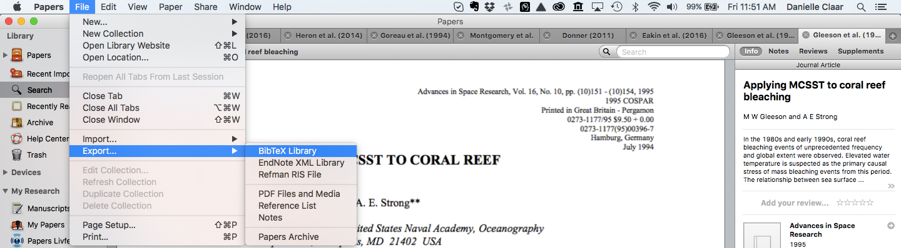
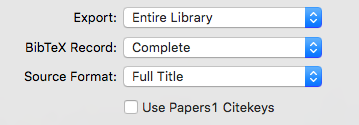

Writing your first R markdown document? This is your first stop for all those fiddly formatting issues.

## First steps  
Make sure that you have done the following in RStudio:  
`install.packages('knitcitations')  
install.packages('bibtex')`  
This bit of code (below) is in the template ms file, but if you are starting from scratch you will need to insert this into the document you want to knit:  
`library(knitcitations); cleanbib()  
cite_options(citation_format = "pandoc", check.entries=TRUE)  
library(bibtex)`  

To find all of the citation styles, fork this directory into your GitHub account:  
https://github.com/citation-style-language/styles  
Then, clone it to your computer using `git clone YOUR_URL_HERE` e.g. for me (Danielle) it would be `git clone https://github.com/daniclaar/styles.git`  
Now, you have all of the citations styles locally on your computer. My strategy has been to find the one that I'd like to use (e.g. Global Change Biology), and then copy that .csl file (e.g. global-change-biology.csl) into your PROJECT_NAME/ms (manuscript) folder. This way it can be directly sourced while knitting the document.  
  
## Getting an initial .bib file  
If you are using Papers, go to File>Export>Bibtex Library  
  
Make sure the settings look like this:  
  
And export this to your PROJECT_NAME/ms folder, named YOURINITIALS_PapersLibrary_Bibtex.bib  
  
## More general markdown writing tutorials:

<http://assemble.io/docs/Cheatsheet-Markdown.html>

## In-text symbols and simple formatting

^superscript^  
~subscript~  
$^\circ$ is a degree symbol  

*text in italics* (one * on each side of the text)  
**text in bold** (two * on each side of the text)

\* to add any symbol on your keyboard that has another function in R-markdown (e.g. if you want to use * (which is generally reserved for italicizing text in R-markdown)to describe wildcard WoS search or interaction term): 

To comment out a section, highlight and press command + shift + C. Or use:  
<!--this comments out a section-->

### Equations

$ for an in-line equation  
$$ for an equation on a separate line  

Not sure yet how to number equations.....

### For Figures, Tables and code chunks

`{r, Arguments}
Code here - if anything is printed/output from this code, it will be put on a separate line 
You can still comment out lines using a hashtag as usual in R
`

Arguments:
`eval=FALSE` [ignore code chunk - i.e. do not run the code chunk at all]  
`include = FALSE`  [run the code chunk, but do not include any of the output in the knitted pdf]
`warning = FALSE` [don't print any warnings that R produces while running your code chunk in the knitted pdf]
`echo =  FALSE` [don't print the commands from the code chunk into the knitted pdf]

#### Call R commands in text

`r {some R command}` To run code in-line with the text

## To call in an image file

``

### References
entry = NULL will only read citations that are referred to in the text  
append = FALSE will overwrite the bib file each time you knit your document  
file = is the new final bib file    

Compile your reference list with:

`{r, warning=FALSE, message=FALSE, echo=FALSE}
write.bibtext(entry=NULL, file='knitcitations.bib', append=FALSE)
`

To make your Rmd file automatically update the date that it was knitted, add:
date: "`r format(Sys.time(), '%d %B, %Y')`" in the top YAML section of the document

In general...
- it doesn't like it when you use setwd() within code chunks (so don't do it!). All file paths within R code chunks are relative to where the .Rmd file is located. So, if you are using our standard file structure and your .Rmd file is in GitProjectName/ms/, then to call in data, you would use ../data/fileyouwant The ../ tells it to look up one directory, and then down into the data directory for your file. 

## If you are having troubles with knitting with embedded inline R code, try surrounding your code with $  
e.g. `r fsn.cover` to $`r fsn.cover`$  
This allows rmarkdown/knitr to interpret any R output which comes out with any scientific notation (exponents, etc.)  
  
Related: if your R output is in scientific notation, and you'd rather just have it in plain numbers (e.g. 1e10^4 vs 10000), use format like this: `r format(fsn.cover.N,scientific=FALSE)`

